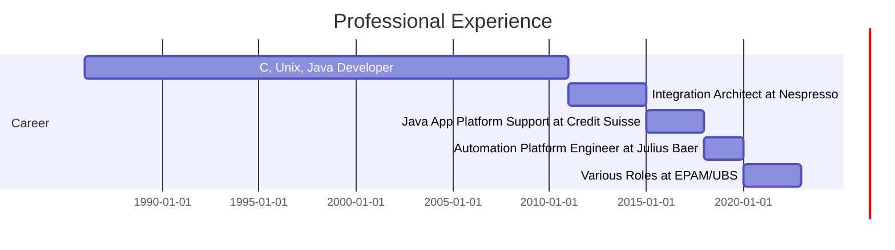

# Self Presentation

## Experience

### 1986-2011
- Worked as **C, Unix, and Java developer**, CRM and OSB specialist in major banks, insurance companies, and Telecom sectors across **USA, Africa, Asia, and Northern Europe**.
- **5 years** as a technical trainer.

### 2011 - Nespresso
- **Integration (coding) architect**
- Technologies: **Python, Java, OSB WebLogic, MQ**
- Responsibilities: CMDB, tracking and monitoring, performance optimization, automated environment configuration and deployment, monitoring

### 2015 - Credit Suisse
- Support on **Java App Platform (WebLogic)**
- Monitoring, troubleshooting, and engineering of the **OpenShift** solution
- **Kubernetes Certified**

### Julius Baer
- Engineering of the **automation platform**
- Technologies: **JBoss, Spring Boot, Spring Cloud Config, Sleuth/Micrometrics, OpenShift**
- Support to teams regarding **deployments and code management**
- **Nexus administration**

### EPAM/UBS

#### PKR MEC migration (WM)
- **Spring Boot development**
- **Camunda Workflow + JSP**

#### PolePosition (IB)
- **Spring microservices**
- Optimizing **security processing & performance improvement**
- **Production support**
- **SB application** to enable BAs to run simulations
- **AppDynamics** integration

#### CAWB
- **React/Spring Boot development**
- Migration to **Java 17 + Spring Boot 3 (Spring 5/6)**
- **Fortify + NexusIQ security enhancements**
- Development of the **O6P component (encryption 3PEDI)**
- **API Management (OpenAPI 3.0)**
- **GitLab Pipelines & Docker Images** (Wheelwright USB RHEL8, Ubuntu)
- Some **React coding**
- **Spring Boot (Thymeleaf) application** for BAs to explore configuration
- **Managed 30 components**

---

## Certifications

- **Azure Certifications:**
  - AZ-900 (Fundamentals)
  - AI-900 (AI Fundamentals)
  - AZ-204 (Azure Developer)
  - Azure Architect (Almost)
  
- **Kubernetes Certified**
- **Coursera Neural Networks (Andrew Ng)**




```mermaid
radar
    title Fields of Expertise
    axes
        "Java" : 5
        "Python" : 4
        "Spring Boot" : 4
        "React" : 3
        "Kubernetes" : 4
        "OpenShift" : 4
        "Camunda Workflow" : 3
        "JBoss" : 3
        "WebLogic" : 4
        "OSB" : 4
```


